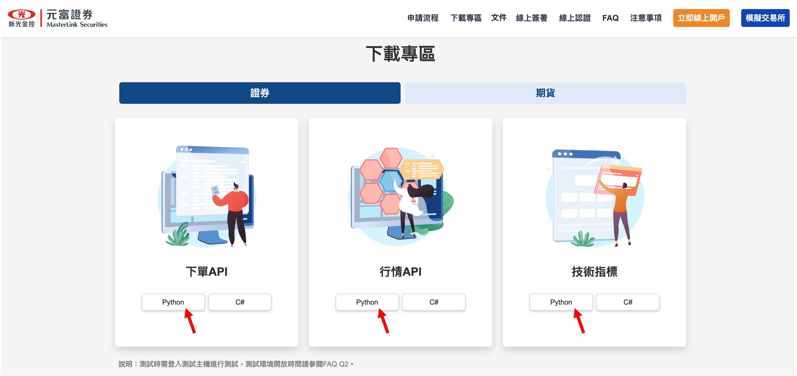

# AutoTraderX

<p align="left">
    <a href="./LICENSE"></a>
    <a href=""></a>
</p>

## 介紹

<div align="center">
    
</div>

本專案主要為串接證券商 API 並進行自動交易。

## 技術文件

本專案的使用方式和設定的說明，請參閱 [**AutoTraderX Documents**](https://docsaid.org/docs/category/autotraderx)。

## 安裝步驟

目前沒有提供 Pypi 上的安裝包，短時間內也沒有相關規劃。

若要使用本專案，你必須直接從 Github 上 clone 本專案，然後安裝相依套件。

本專案受限於元富證券 API，只能運行在 Windows 作業系統上，安裝前請確保你已經在 Windows 作業系統上配置好 Python 環境。

### Python 環境配置

請參考我們所撰寫的文章進行安裝：

- [**簡單配置 Win11 系統的 Python 環境**](https://docsaid.org/blog/windows-python-settings)

### 安裝 AutoTraderX

1. **Clone 本專案：**

   ```powershell
   git clone https://github.com/DocsaidLab/AutoTraderX.git
   ```

2. **進入專案目錄：**

   ```powershell
   cd AutoTraderX
   ```

3. **安裝相依套件：**

   ```powershell
   pip install setuptools wheel
   ```

4. **建立打包文件：**

   ```powershell
   python setup.py bdist_wheel
   ```

5. **安裝打包文件：**

   ```powershell
   pip install dist\autotraderx-*-py3-none-any.whl
   ```

遵循這些步驟，你應該能夠順利完成 `AutoTraderX` 的安裝。

### 安裝元富證券 Python API

從元富證券官方網站下載 Python API：

- [**元富證券-下載專區**](https://mlapi.masterlink.com.tw/web_api/service/home#download)

  

下載後解壓縮，並使用 pip 安裝：

```powershell
pip install .\MasterTradePy\MasterTradePy\64bit\MasterTradePy-0.0.23-py3-none-win_amd64.whl
pip install .\Python_tech_analysis\tech_analysis_api_v2-0.0.5-py3-none-win_amd64.whl
pip install .\SolPYAPI\PY_TradeD-0.1.15-py3-none-any.whl
```

安裝完成後即可以使用本專案。

- **補充說明：**

  本專案亦有提供元富證券 Python API 的 .whl 安裝檔案，在 `MasterLink_PythonAPI` 資料夾中。

  你可以直接執行以下指令安裝：

  ```powershell
  .\run_install.bat
  ```

  請注意我們不會更新這些檔案，請自行至元富證券官方網站下載最新版本。

## 測試安裝

你可以使用以下指令來測試安裝是否成功：

```powershell
python -c "import autotraderx; print(autotraderx.__version__)"
# >>> 0.1.0
```

如果你看到類似 `0.1.0` 的版本號，則表示安裝成功。

## 學習資源

- [**股票量化交易從零開始（一）元富證券 API 權限申請**](https://quantpass.org/masterlink-api/)
- [**股票量化交易從零開始（二）Python 環境設置**](https://quantpass.org/masterlink-3/)
- [**股票量化交易從零開始（三）驗證行情與下單權限申請**](https://quantpass.org/masterlink-4/)
- [**股票量化交易從零開始（四）抓取股價歷史資料**](https://quantpass.org/masterlink-5/)
- [**股票量化交易從零開始（五）台股交易策略**](https://quantpass.org/masterlink-6/)
- [**下載憑證 e 管家**](https://www.masterlink.com.tw/certificate-eoperation)

## 引用

```bibtex
@misc{yuan2024autotraderx,
  author = {Ze Yuan},
  title = {AutoTraderX},
  year = {2024},
  publisher = {GitHub},
  journal = {GitHub repository},
  howpublished = {\url{https://github.com/DocsaidLab/AutoTraderX}}
}
```
