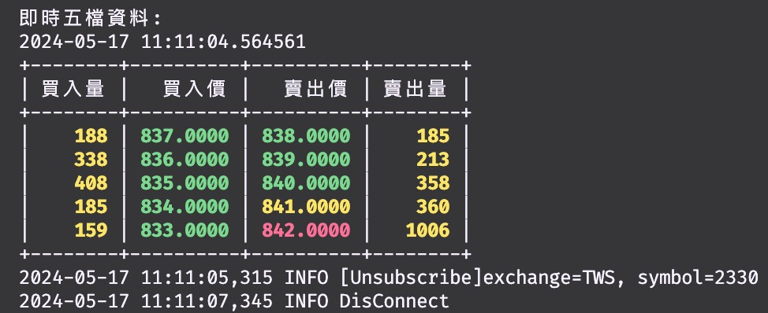

# AutoTraderX

## 介紹

本專案的目標為實作 Python 自動交易程式，串接目標為元富證券(MasterLink)的 Python API。

由於該公司提供的 API 僅能在 Windows 環境下執行，因此使用者必須具備基於 Windows 的 Python 作業環境。

## 學習資源

- [**股票量化交易從零開始（一）元富證券 API 權限申請**](https://quantpass.org/masterlink-api/)
- [**股票量化交易從零開始（二）Python 環境設置**](https://quantpass.org/masterlink-3/)
- [**股票量化交易從零開始（三）驗證行情與下單權限申請**](https://quantpass.org/masterlink-4/)
- [**股票量化交易從零開始（四）抓取股價歷史資料**](https://quantpass.org/masterlink-5/)
- [**股票量化交易從零開始（五）台股交易策略**](https://quantpass.org/masterlink-6/)

- [下載憑證e管家](https://www.masterlink.com.tw/certificate-eoperation)

## 安裝必要套件

由於本專案為私有專案，因此只能透過 SSH 協議下載。

請你確保有將自己的 SSH-PubKey 已經新增至 github 帳號，接著：

1. 使用 git clone 下載專案

   ```bash
   git clone git@github.com:DocsaidLab/AutoTraderX.git
   ```

2. 安裝必要套件

   確保你的程式執行環境，根據以下步驟執行。

   - 使用 MiniConda 安裝 Python 環境。

   - 安裝必要 Python 套件：

     ```bash
     pip install ./MasterLink_PythonAPI/MasterTradePy/MasterTradePy/64bit/MasterTradePy-0.0.23-py3-none-win_amd64.whl
     pip install ./MasterLink_PythonAPI/Python_tech_analysis/tech_analysis_api_v2-0.0.5-py3-none-win_amd64.whl
     pip install ./MasterLink_PythonAPI/SolPYAPI/PY_TradeD-0.1.15-py3-none-any.whl
     ```

## 主程式開發紀錄

- 主程式：`main.py`

- 2024/05/07：

  - PythonAPI 線上下單驗證成功。
  - PythonAPI 報價系統驗證成功。

- 2024/05/11：

  - 新增主程式

    - 重新設計下單操作介面
    - 串接元富證券 API，並且進行登入、登出的測試。
    - 查詢庫存測試：get_inventory()：取得帳戶持股資訊。

  - 懸念：

    - 這個 qid 似乎不是一個即時的回傳結果，必須有 pause 才能看到輸出，這裡之後看要怎麼串接這個回傳結果
    - 目前券商開放的 API 接口有限，庫存的成交明細無法取得，這裡之後要再想辦法
    - 之後得接著看報價系統該如何串接到主程式。

  - 目前可以玩的功能：

    ```python
    handler = AutoTraderX(is_sim=True)

    handler.login()
    handler.get_inventory()
    handler.get_order_report()
    handler.get_trade_report()
    handler.stop()
    ```

- 2024/05/12：

  - 研究報價系統串接

    - 進行報價系統的測試，並且成功取得即時報價資訊。
    - 重構由元富提供的範例程式 `Sample_D.py`，實在寫得太糟了。
    - 重構結果：`trading_api.py`

  - 懸念：

    - 報價系統的運作機制還有許多不清楚的地方，等到開盤日才來測試看看取得資料的內容，還有裡面各種 Event 的運作方式。

- 2024/05/17：

  - 重新命名：`trading_api.py` -> `quotation_system.py`
  - 報價系統串接完成

    - 成功取得目標證券基本資料。
    - 成功取得即時報價成交五檔資料。
    - 成功取得即時報價成交明細資料。

  - 資訊輸出介面

    - 基本資料輸出介面實作完成。
    - 五檔資料輸出介面實作完成。
    - 成交資料輸出介面實作完成。
    - 簡單的文字渲染，區分漲跌價格。
    - 支援 `Ctrl+C` 中斷程式功能。

      

  - 懸念：

    - 報價系統已經串回 `main.py`，接著就要開始撰寫交易策略了。
    - 下單系統的回傳資料需要從 `ConcreteMarketTrader` 這個東西下手，要看一下怎麼串接回來。

- 2024/05/21：

  - 完成查詢庫存、查詢成交報告、查詢下單報告的功能。

  - 懸念：

    - 透過 API 無法查到庫存均價，這部分必須自己設計每日成交紀錄模組，並且且每日更新。

- 2024/06/06:

  - 程式解耦合，梳理架構和重構，設計策略串接點。
  - 系統分為三個部分：
    1. 報價系統，最小單位為個股的類別
    2. 下單系統，主要功能為查詢庫存、成交和下單
    3. 策略串接系統，將策略帶入報價系統中，依照事件觸發
  - 另外一個是中期規劃：回測系統

    如果要計算技術指標，那是必須要取得過去的交易價格才能用來計算技術線圖，這表示策略系統和回測系統必然會有頻繁的資料交換

  - 懸念：

    - 向券商訂閱股票時是否需要每次登入？還是說登入之後可以訂閱多張股票？如果是後者，那輸出資訊呈現方式如何？